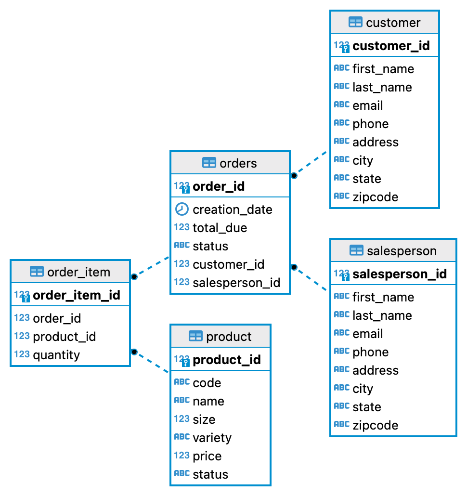

# Introduction
The JDBC App uses the Java Database Connectivity (JDBC) to perform queries on a PostgreSQL database containing customer records and their orders from a retail store. The CRUD (Create Read Update Delete) operations were implemented using Data Access Objects(DAO) and Data Transfer Objects (DTO). I was using containerized PostgreSQL while maven handled all the project dependencies. The project was implemented using Java core, Maven, JDBC, PostgreSQL, Docker, and DBeaver.

# Implementation
The project was implemented using Agile methodology. The database was created together with the required Tables. The ER-Diagram is used to represent the relationship between the entities.
## ER Diagram
The Entity-Relationship Model describes the structure of the database with the aid of a diagram known as the ER-Diagram. The ER Diagram shows the main components of the ER model, including the entity set, their attributes, and the relationship set.  There are five entities as shown:
orders, customer, salesperson, product, and order item. The associative cardinalities between the entities are shown. DBeaver was used to generate the ER Diagram.

## Design Pattern
**Data Access Object (DAO)** design pattern is a structural pattern that was used to isolate the JDBC application from the PSQLdatabase using an abstract API. the DAO Create Read Update and Delete (CRUD) operations were successfully executed on the database using a single function call. The Data Transfer Object are objects that carry data between processes to reduce the number of method calls. The purpose of this pattern in our app design was to batch up multiple parameters in a single call.

**Repository pattern:** A mechanism for encapsulating storage, retrieval, and search behavior that emulates a collection of objects. It also deals with data and hides queries that are similar to DAO. It is used to join tables in a code, which is more useful in a distributed database

# Test
The database was tested by writing some SQL queries through PSQL CLI. These query operations add, update, and delete records on the database. The JDBCExecutor has the main method used that executes other classes. 