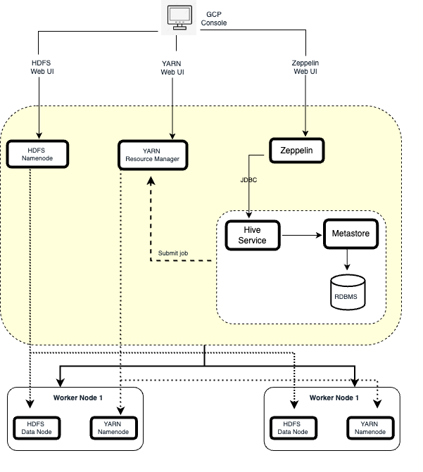
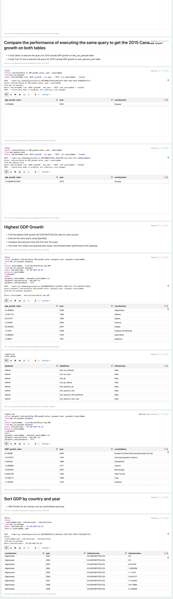

# Table of contents
* [Introduction](#Introduction)
* [Hadoop Cluster](#hadoop-cluster)
* [Hive Project](#hive-project)
* [Improvement](#improvement)

# Introduction
In this project, The Jarvis data analytics team wants to switch from using SAP and R to process the data to some big data platforms. This project helped the data analytics team process big data using Apache Hadoop. Hadoop is a collection of open-source software utilities that facilitate using a network of many computers (cluster) to solve problems involving massive amounts of data and computation. 
The core of Apache Hadoop consists of `Hadoop Distributed File System (HDFS)`, `MapReduce`, and `YARN`. Hive which offers SQL-like query language was also used in the project to facilitate the MapReduce job. I was assigned to analyze the WDI world bank big Query data that contains about a 22million rows.  To perform any action on the data, the following tasks were first completed:
1. Provisioned the Hadoop Cluster on the Google Cloud Platform
2. Exported the BigQuery Data to Google File System 
3. Set up the Zeppelin Notebook for querying the database
4. Wrote some Hive commands for experiments

# Hadoop Cluster
The diagram shows the cluster architecture having 1 master and 2 workers nodes. It also shows the HDFS, YARN, Zeppelin, and Hive. Both the master and workers nodes were configured to have 12GB of memory, 2 cores CPU, and 100GB of HDD each. 

##  Big data tools 
- HDFS: Hadoop Distributed File System is designed to store a very large amount of information (terabytes or petabytes). 

- Name Node: The name node manages the filesystem namespace. It maintains the filesystem tree and the metadata for all the files and directories in the tree.
- Data Node: Datanodes are the workhorses of the filesystem. They store and retrieve blocks when they are told to (by clients or the name-node), and they report back to the name-node periodically with lists of blocks that they are storing.
- MapReduce: It is a Hadoop component that allows a developer to write distributed algorithms. It consists of Inputformat, input split, record reader
- Apache YARN: Yet Another Resource Negotiator is Hadoop’s 
cluster resource management system. YARN provides APIs for requesting and working with cluster resources.
- Resource Manager: The Resource Manager (RM) is responsible for tracking the resources in a cluster, and scheduling applications
- Node Manager: It is responsible for launching and managing containers on a node.
- Hive: A framework for data warehousing on top of Hadoop
 Hive was created to make it possible for analysts with strong SQL skills to run queries on huge volumes of data.
- Hive Client: There are different mechanisms for connecting to hive applications, e.g. JDBC driver (beeline), ODBC driver, thrift.
- Metastore: The metastore is the central repository of Hive metadata
- Apache Zeppelin: Web-based notebook that enables data-driven, interactive data analytics and collaborative documents with SQL, Scala, Python, R, and more.

# Hive Project
### Screeenshot of Zeppelin Notebook used for the implementation

When working with big data, optimization is very paramount to improve the efficiency of the queries. I optimized the query performance by partitioning the table so that only the required partition is used at a given time instead of always loading all the data into the memory. This significantly improves performance and reduces the Hadoop cluster workload compared to the multiple insert case. The concept of columnar file format was also used for optimization since it improves performance when Hive is reading, writing, and processing data. Columnar file format encourages faster queries to get each row in a table. 

# Improvement
- More worker nodes can be added to improve the performance and the execution time
- Faster query using map-side join and indexing
- Using bucketing to improve the query performance when working on big data