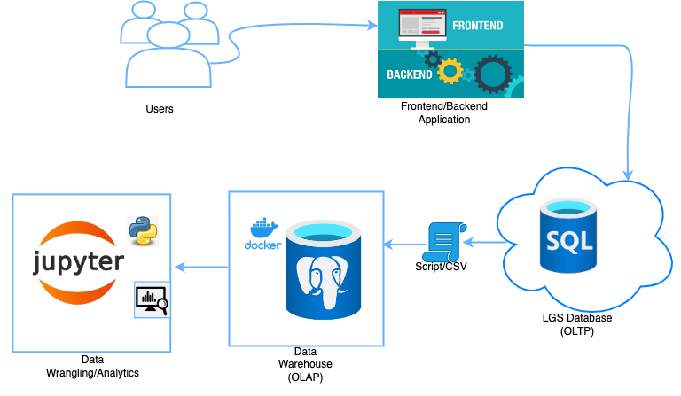

# Introduction
I was assigned to help a marketing department of an online store to analyze their customers' shopping behavior to understand how to develop good sales and marketing strategies that can increase their revenue. The data was directly accessed as a CSV or SQL file through their data warehouse. This project was implemented using Python programming and its libraries such as NumPy, Pandas, Matplotlib, and SQLAchemy on a Jupyter notebook. 

# Implementation

## Project Architecture

The customer places their orders on the e-commerce website through the front-end (user interface) and the order is stored at the backend (database) on the Azure SQL server for real-time Online Transaction Processing (OLTP) which is further stored in the  PostgreSQL data warehouse for Online Analytical processing. 
The data was accessed directly as an SQL file. As part of the Extract Transform and Load (ETL) process, sensitive information such as customer name, phone number, and address is removed. 
## Data Analytics and Wrangling
### Data Wrangling
The dataset contains a total of 1067371 records and 8 attributes(columns). The attributes considered include: 
- invoice_no: A 6-digit integer number that is uniquely assigned to each transaction when an order is placed. It contained 0 null value
- stock code: A 5-digit integer number that is uniquely assigned to each product, contains 0 null values
- Description: A text that describes the product item. Contains 4382 null values
- Quantity: An integer value that shows the total number of each ordered distinct item. Contains 0 null value. 
- Invoice_date: A timestamp datatype that shows the date and time an order was placed. Contains 0 null value.
- unit_price: A float number that shows the unit price for each item. Contains 0 null value.
- customer_id: A 5-digit integer number that is uniquely assigned to each customer when an order is placed. Contains 243007 null values.

To understand the data more, I used some statistical tools to visualize the data. I used a histogram to understand the data distribution. A box plot to observe and remove outliers. Null values were dropped from the dataset and about 805549 values were realized which were used for the data analytics. 

### Data Analytics
I performed some descriptive analytics using `RFM segmentation` technique to categorize customers into different segments according their interaction with the online store, this is to determine the marketing and sales strategies based on buying habits of customers. I used the RFM based score in the range of 1-5.  Based on the calculated RFM Score, the customers are grouped into `10 Segments`:

``` 
About to Sleep, At Risk, Champions, Can't Lose, Hibernating, Loyal Customers, Need Attention, New Customers, Potential Loyalists, Promising
```
The following results were generated after the analytics:
 `Can't Lose = 71`, `Hibernating = 1522`, `Champions = 852`
- Can't Lose Segment: these are customers who have: 
    * The last shopping date on average of 353 days before.
    *  made an average of 16 purchases.
    *  Spent an average of £ 8356.
- Hibernating:  these are customers who have: 
    - The last shopping date of 481 days before average.
    - Made an average of 1 purchase.
    - Spent an average of £ 438
- Champions Segment:  these are customers who have: 
    - The last shopping date of 30 days before the average.
    - Made an average of 19 purchases.
    - Spent an average of £ 10796.

 In conclusion, the company has to: 
1. Prepare a `discount` and `gift campaign` for the `Can't Lose Segment`, since they have made a large number of purchases, and the campaign should be targeted at what these customers tend to always buy most.
2. Offer a `special discount` for `hibernating customers`, to attract them to start making a purchase again. They should also find out the reason behind the gap in their purchasing habit. 
3. Implement `campaigns` that ensure the continuity of the `Champions Segments` customers since they have contributed a lot towards most revenue of the company.

# Improvements
- Find out the most frequently purchased items, to help the company determine the right product to promote.
- Build models that can perform the targeted marketing that improves customer's experience while making their purchases online.
